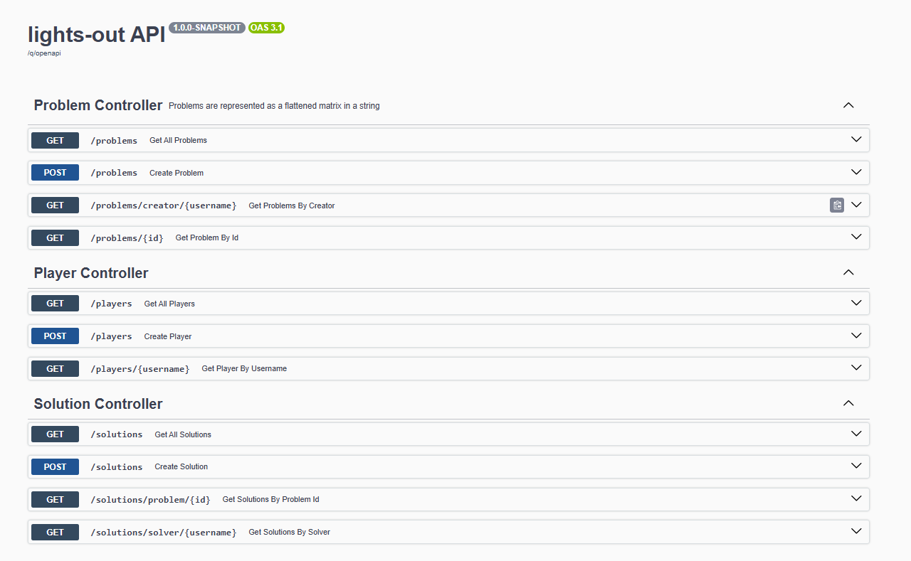

# Lights Out API

A backend application built with **Quarkus** and **Jakarta EE** for creating and solving the classic **Lights Out** puzzle.

## Lights Out Game

"Lights Out" is a logic puzzle played on an `n x n` binary matrix (values `0` or `1`). The goal is to turn all cells to `1` by "pressing" cells. Pressing a cell toggles it and its adjacent (up, down, left, right) cells.

Problems are saved as a **flattened string**.

Example:

> For this image, the problem would be represented as `"001010001"`
> 
> The first character in the string corresponds to: **x = 0**, **y = 2**
> 
> The red-pressed cell corresponds to: **x = 2**, **y = 1**

---

## Features

- Create and retrieve players, problems, and solutions
- Automatic problem validation (only solvable problems are saved)
- Verifies user-submitted solutions
- REST API documented via Swagger
- Full database integration (PostgreSQL)

---

## REST API

The API is available at: (/q/swagger-ui/)

The API documentation is very detailed. It specifies all the errors.

